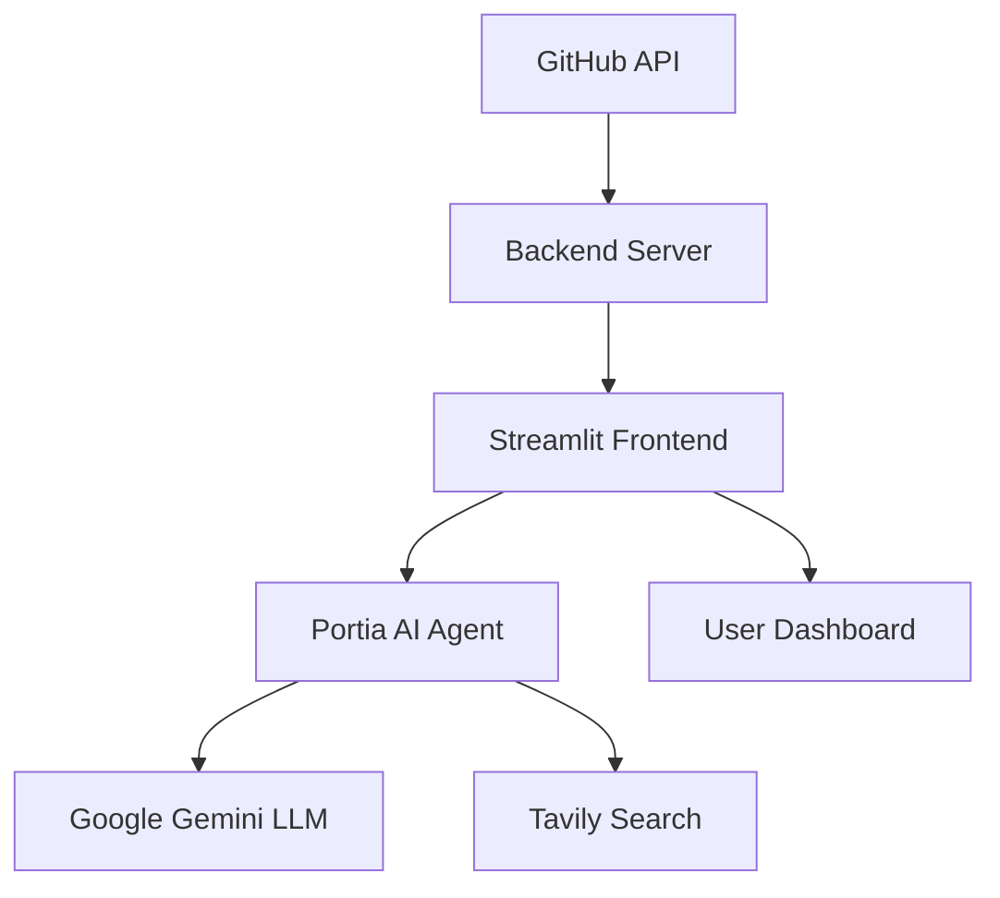

# 🚀 DevOps AI Assistant


> **Intelligent CI/CD Pipeline Management with AI-Powered Insights**

A powerful DevOps assistant that combines real-time GitHub Actions monitoring with AI-driven troubleshooting and recommendations. Built with Portia AI for intelligent agent management and enhanced with web search capabilities.

## ✨ Features

- 📊 **Real-time Pipeline Monitoring** - Live GitHub Actions workflow status
- 🤖 **AI-Powered Chat** - Portia AI assistant with context awareness  
- 🔍 **Intelligent Analysis** - Smart troubleshooting and recommendations
- 📋 **Repository Management** - Easy switching between multiple repos
- 📈 **Detailed Logging** - Comprehensive pipeline execution logs
- 🌐 **Web Search Integration** - Enhanced responses with Tavily search

## 📸 Screenshots

*Coming soon - Add screenshots of your dashboard here*

## 🚀 Quick Start

**New to the project?** Start here: **[📚 Getting Started Guide](docs/GETTING_STARTED.md)**

### One-Minute Setup
```bash
# 1. Clone the repository
git clone (https://github.com/Hritikraj8804/Hritikraj8804-Portia_hack.git)
cd portia

# 2. Install dependencies  
pip install -r requirements.txt

# 3. Configure API keys
cp .env.example .env
# Edit .env with your keys (see API Keys Guide)

# 4. Start the application
quick-start.bat  # Windows
# Or: python backend/simple_backend.py & streamlit run frontend/app.py
```

**Access your dashboard:** http://localhost:8501

## 📚 Documentation

| Document | Description |
|----------|-------------|
| **[🚀 Getting Started](docs/GETTING_STARTED.md)** | Complete setup guide for new users |
| **[🔑 API Keys Setup](docs/API_KEYS.md)** | How to obtain all required API keys |
| **[📚 User Guide](docs/USER_GUIDE.md)** | Learn how to use all features |
| **[🔌 API Reference](docs/API_REFERENCE.md)** | Backend API documentation |
| **[🔧 Troubleshooting](docs/TROUBLESHOOTING.md)** | Common issues and solutions |
| **[❓ FAQ](docs/FAQ.md)** | Frequently asked questions |
| **[🤝 Contributing](docs/CONTRIBUTING.md)** | How to contribute to the project |

## 🏢 Architecture



**Tech Stack:**
- **Frontend:** Streamlit (Python web framework)
- **Backend:** Python HTTP server with GitHub API integration
- **AI:** Portia agent manager with Google Gemini LLM
- **Search:** Tavily web search for enhanced responses
- **Data:** Real-time GitHub Actions workflows

## ⚙️ System Requirements

- **Python 3.11+** (3.13 recommended)
- **Operating System:** Windows, macOS, or Linux
- **Memory:** 4GB RAM minimum (8GB recommended)
- **Network:** Internet connection for API calls
- **GitHub Account:** For repository access

## 🔑 Required API Keys

| Service | Purpose | Required |
|---------|---------|----------|
| **Google API** | Portia AI language model | ✅ Yes |
| **Portia AI** | Agent management | ✅ Yes |
| **GitHub Token** | Repository access | ✅ Yes |
| **Tavily API** | Enhanced search | ❌ Optional |
| **Hugging Face** | Additional AI features | ❌ Optional |

**Need help getting keys?** → [API Keys Setup Guide](docs/API_KEYS.md)

## 🎆 Demo

### What You Can Do

1. **📋 Monitor Multiple Repositories**
   - Browse GitHub repositories
   - Search and filter repositories
   - Switch between projects instantly

2. **📈 Real-time Pipeline Insights**
   - Live GitHub Actions status
   - Success/failure metrics
   - Detailed execution logs
   - Error analysis and debugging

3. **🤖 AI-Powered Assistance**
   - Ask questions about pipeline failures
   - Get DevOps best practice recommendations
   - Troubleshoot issues with context-aware AI
   - Web search integration for enhanced answers

### Sample Conversations
```
👤 User: "Why did my build fail?"
🤖 Portia: "I can see 2 failed pipelines in your repository. 
         The main issue is a test failure in the CI pipeline. 
         Let me search for solutions..."

👤 User: "How can I improve build performance?"
🤖 Portia: "Based on your pipeline data, I recommend:
         1. Parallel test execution
         2. Docker layer caching
         3. Dependency caching strategies..."
```

## 🔌 API Integration

The backend provides RESTful APIs for custom integrations:

```bash
# Get repositories
curl http://localhost:8000/repositories

# Get pipeline status
curl "http://localhost:8000/pipelines?owner=username&name=repo"

# Get detailed logs
curl http://localhost:8000/pipelines/run_123/logs
```

**Full API documentation:** [API Reference](docs/API_REFERENCE.md)

## 🤝 Contributing

We welcome contributions! Here's how to get started:

1. **🍴 Fork the repository**
2. **🌱 Create a feature branch**
3. **✨ Make your changes**
4. **🧪 Add tests**
5. **📤 Submit a pull request**

**Detailed guide:** [Contributing Guidelines](docs/CONTRIBUTING.md)

### Areas We Need Help With
- 🐛 Bug fixes and error handling
- 🎨 UI/UX improvements
- 📚 Documentation and examples
- ⚡ Performance optimizations
- 🧪 Test coverage expansion

## 👥 Community

- **💬 Discussions:** Ask questions and share ideas
- **🐛 Issues:** Report bugs and request features  
- **📦 Pull Requests:** Contribute code improvements
- **⭐ Star the repo:** Show your support!

## 🏆 Acknowledgments

- **Portia AI** for intelligent agent management
- **GitHub** for comprehensive API access
- **Streamlit** for rapid web app development
- **Google** for powerful language models
- **Open source community** for inspiration and tools

## 🔒 Security & Privacy

- **🔐 API keys stored locally** - Never committed to version control
- **🔒 Secure token handling** - Proper authentication practices
- **🚫 No data persistence** - Your data stays with you
- **🌐 Standard API usage** - Only accesses what you authorize

## 📄 License

MIT License - See [LICENSE](LICENSE) file for details.


<div align="center">

**Ready to revolutionize your DevOps workflow?** 🚀

[Get Started](docs/GETTING_STARTED.md) • [View Demo](#demo) 

**Built with ❤️ by the open source community**

</div>
